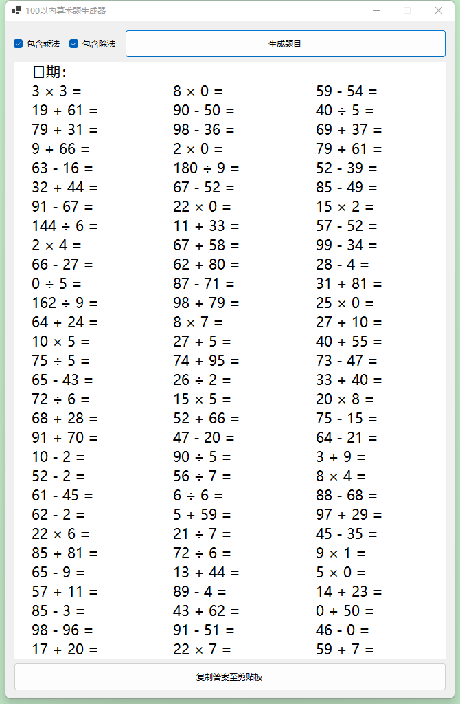

# MathGenerator
Windows窗体应用版 加减乘除算式生成器，`Setup/Release1.1.2.zip` 为当前版本最新的安装程序压缩包，解压后可直接在Windows系统上进行安装使用。

## 环境
本项目使用 [Visual Studio Community](https://visualstudio.microsoft.com/vs/community/) 基于 [.Net 6.0](https://dotnet.microsoft.com/en-us/download/dotnet/6.0) 开发（未使用任何新特性，因此在低版本 .Net 上应该可以正常运行，我猜的 - 手动狗头）。

## 程序截图

